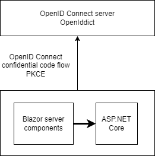

# Secure Blazor Web using OpenID Connect

[](https://github.com/damienbod/BlazorWebOidc/actions/workflows/dotnet.yml)

[Implement a secure Blazor Web application using OpenID Connect and security headers](https://damienbod.com)



## Step 1: Init solution from the .NET Blazor samples

https://github.com/dotnet/blazor-samples/tree/main/8.0/BlazorWebAppOidc

## Step 2: Switch the OpenID Connect server

Set this as the used OIDC client recommends. If using the default, something like this:

```csharp
builder.Services.AddAuthentication(OIDC_SCHEME)
.AddOpenIdConnect(OIDC_SCHEME, options =>
{
    // From appsettings.json, keyvault, user-secrets
    builder.Configuration.GetSection("OpenIDConnectSettings").Bind(options);
})
.AddCookie();
```
> Note:
> Each identity provider uses different OIDC configurations and events.

## Step 3: Disable WASM mode

Blazor Web WASM does not support CSP nonces. If you require this, then you need to disable security features.

Switch to server components:

In the **Program.cs**, switch

```csharp
builder.Services.AddRazorComponents()
    .AddInteractiveServerComponents()
    .AddInteractiveWebAssemblyComponents();
```

to

```csharp
builder.Services.AddRazorComponents()
    .AddInteractiveServerComponents();
```

In the **Program.cs**, switch

```csharp
app.MapRazorComponents<App>()
    .AddInteractiveServerRenderMode()
    .AddInteractiveWebAssemblyRenderMode()
    .AddAdditionalAssemblies(typeof(Counter).Assembly);
```

to

```csharp
app.MapRazorComponents<App>()
    .AddInteractiveServerRenderMode()
    .AddAdditionalAssemblies(typeof(Counter).Assembly);
```

In **App.razor**: 

```
    <HeadOutlet @rendermode="InteractiveAuto" />
</head>
<body>
    <Routes @rendermode="InteractiveAuto" />
```

to

```
    <HeadOutlet @rendermode="InteractiveServer" />
</head>
<body>
    <Routes @rendermode="InteractiveServer" />
```

## Step 4: Add CSP nonce middleware

Blazor Web WASM does not support CSP nonces. If you require this, then you need to disable security features.

```csharp
builder.Services.TryAddEnumerable(ServiceDescriptor.Scoped<CircuitHandler, BlazorNonceService>(sp =>
     sp.GetRequiredService<BlazorNonceService>()));
builder.Services.AddScoped<BlazorNonceService>();
```

```csharp
app.UseMiddleware<NonceMiddleware>();
```

Nonce services are in the **CspServices** folder in the BlazorWebAppOidc project.

## Step 5: Add security headers

Security headers can reduce the attack surface in the application. This is applied as best possible for the tech stack requirements.

```csharp
app.UseSecurityHeaders(
    SecurityHeadersDefinitions.GetHeaderPolicyCollection(
        app.Environment.IsDevelopment(),
        app.Configuration["OpenIDConnectSettings:Authority"]));
```

See **SecurityHeadersDefinitions.cs**

## Links

https://github.com/dotnet/blazor-samples/tree/main/8.0/BlazorWebAppOidc

https://damienbod.com/2024/02/19/using-a-csp-nonce-in-blazor-web/

https://github.com/damienbod/BlazorServerOidc
